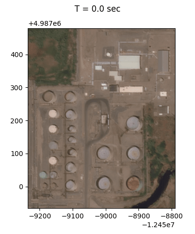

geoclaw-landspill
=================

[](https://github.com/barbagroup/geoclaw-landspill/raw/master/LICENSE)
[](https://travis-ci.com/barbagroup/geoclaw-landspill)
[](https://github.com/barbagroup/geoclaw-landspill/actions?query=workflow%3ACI)

***Note: if looking for content of `geoclaw-landspill-cases`, please checkout tag
`v0.1`. This repository has been converted to a fully working solver package.***

*geoclaw-landspill* is a package for running oil overland flow simulations for
applications in pipeline risk management. It includes a numerical solver and
some pre-/post-processing utilities.

<center></center>

The numerical solver is a modified version of
[GeoClaw](http://www.clawpack.org/geoclaw.html).
GeoClaw solves full shallow-water equations. We added several new features and
utilities to it and make it usable to simulate the overland flow from pipeline
ruptures. These features include:

* adding point sources to mimic the rupture points
* adding evaporation models
* adding Darcy-Weisbach bottom friction models with land roughness
* adding temperature-dependent viscosity
* recording detail locations and time of oil flowing into in-land waterbodies
* removing unnecessary code to improve AMR performance
* downloading topography and hydrology data automatically (the US only)
* generating CF-1.7 compliant NetCDF files

## Documentation
1. [Dependencies, installation, and tests](doc/deps_install_tests.md)
2. [Usage](doc/usage.md)
3. [Containers: Docker and Singularity](doc/container.md)

------------------------------------------------------------------------
## Quick start

Beyond this quick start, to see more details, please refer to
the [documentation](#documentation) section.

### 1. Installation

Install `gfortran`, `python>=3.7`, and `pip`. For example, in Arch Linux:
```
# pacman -S gcc-gfortran python python-pip
```

Or, in Ubuntu Focal:
```
# apt install gfortran python3 python3-pip
```

Then install *geoclaw-landspill* from PyPI
```
# pip install geoclaw-landspill
```

Using system Python and system `pip` requires root privilege and installs the
package to the system path. To install to the user's local path without root
privilege, instead, do
```
$ pip install --user geoclaw-landspill
```
However, if using the `--user` flag, users should make sure `pip`'s local `bin`
path is in `PATH`.

Alternatively, users can consider using virtual environments.

### 2. Running an example case

To run an example case under the folder `cases`, users have to clone this
repository. We currently don't maintain another repository for cases. After
cloning this repository, run
```
$ geoclaw-landspill run <path to an example case folder>
```
For example, to run `utal-flat-maya`:
```
$ geoclaw-landspill run ./cases/utah-flat-maya
```
Users can use environment variable `OMP_NUM_THREADS` to control how many CPU
threads the simulation should use for OpenMP parallelization.

### 3. Creating a CF-compliant NetCDF raster file

After a simulation is done, users can convert flow depth in raw simulation data
into a CF-compliant NetCDF raster file. For example,
```
$ geoclaw-landspill createnc ./case/utah-flat-maya
```
Replace `./cases/utah-flat-maya` with the path to another desired case.

QGIS and ArcGIS should be able to read the resulting NetCDF raster file.

------------------------------------------------------------------------
## Third-party codes and licenses

* amrclaw: https://github.com/clawpack/amrclaw ([LICENSE](third-party/amrclaw/LICENSE))
* geoclaw: https://github.com/clawpack/geoclaw ([LICENSE](third-party/geoclaw/LICENSE))
* pyclaw: https://github.com/clawpack/pyclaw ([LICENSE](third-party/pyclaw/LICENSE))
* clawutil: https://github.com/clawpack/clawutil ([LICENSE](third-party/clawutil/LICENSE))
* riemann: https://github.com/clawpack/riemann ([LICENSE](third-party/riemann/LICENSE))

------------------------------------------------------------------------
## Contact

Pi-Yueh Chuang: pychuang@gwu.edu
