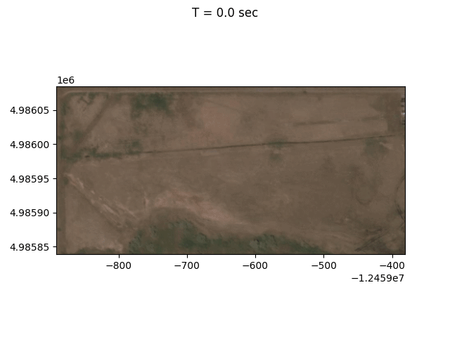
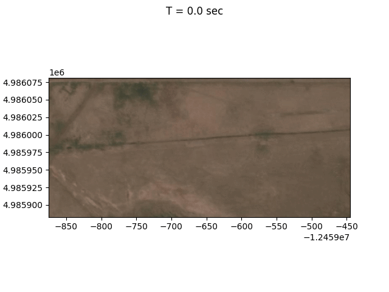
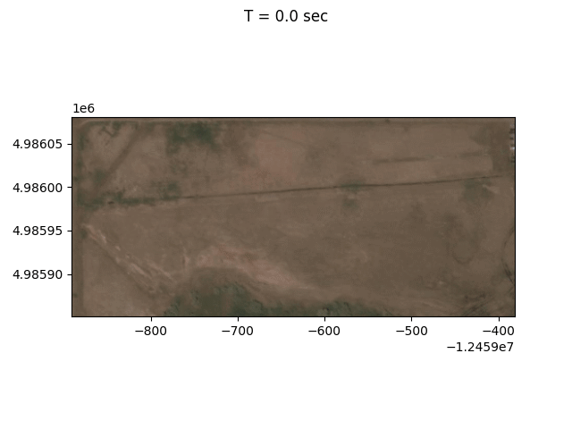
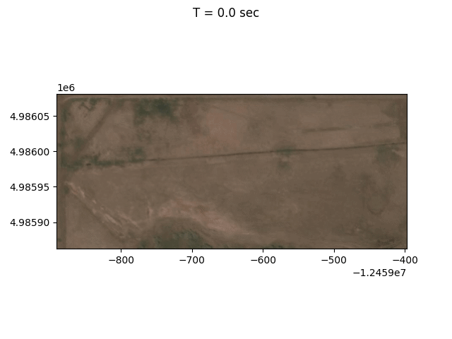
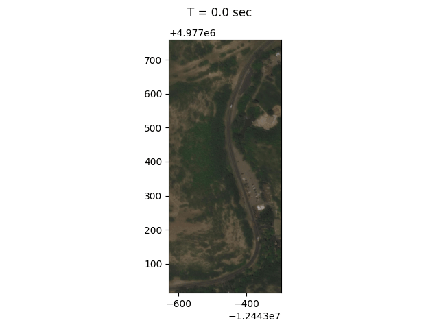
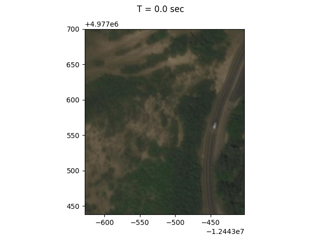
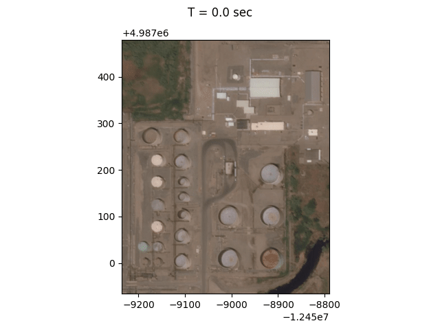
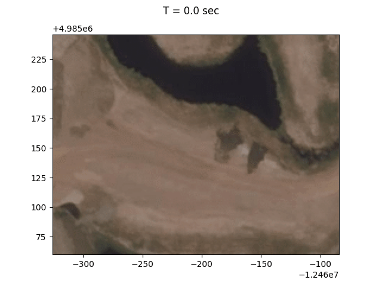
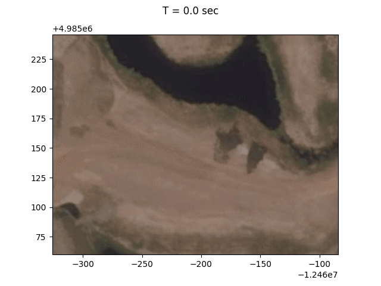

Examples
========

Currently, all examples are from the nearby region of Salt Lake City, Utah, USA.
The naming of examples follows
**{location}-{terrain type}-{oil type}-{additional setting}**.

There are three files Under each example folder:

* `setrun.py`: it serves as the configuration file of the simulation.
* `roughness.txt`: all examples use a Darcy-Weisbach model that considers
  surface roughness. This file provides roughness information to the model,
  though the values are simply `0.1` everywhere.
* `animation.gif`: this is an animation of the flow to give users a sense of how
  their results should look.

For the details of `setrun.py`, please refer to the documentation.

To run an example, do

```
$ OMP_NUM_THREADS={number of CPU threads to use} geoclaw-landspill run {path to a case folder}
```

To create the `animation.gif`s shown below, do

```
$ geoclaw-landspill plotdepth --use-sat {path to a case folder}
```

This command only creates frames used by the animations. The frames are saved
in the folder `_plots/sat/level02/` under each case. Finally, we use
[`ffmpeg`](https://ffmpeg.org/) to combine frames into a GIF animation file:

```
$ ffmpeg \
    -i {case folder}/_plots/sat/level02/frame00%03d.png \
    -vf "fps=20,split[s0][s1];[s0]palettegen[p];[s1][p]paletteuse" \
    {filename to save the resulting animation}
```

For a more serious analysis, users should consider creating a temporal NetCDF
raster file for each case with

```
$ geoclaw-landspill createnc {path to a case folder}
```

The resulting NetCDF file will be at `_output/{case name}-depth-lvl02.nc`.

----------
## List of cases and results

### 1. utah-flat-gasoline-no-evap

Gasoline without evaporation on flat terrain.



### 2. utah-flat-gasoline

Gasoline with evaporation on flat terrain. File `_output/evaporated_fluid.dat`
stores the total volume evaporated at the end of the simulation.



### 3. utah-flat-maya-no-evap

Maya crude oil without evaporation on flat terrain.



### 4. utah-flat-maya

Maya crude oil with evaporation on flat terrain. File `_output/evaporated_fluid.dat`
stores the total volume evaporated at the end of the simulation.



### 5. utah-hill-maya-no-hydro

Maya crude oil on hilly terrain. Evaporation is on, but the in-land waterbody
(a creek in this case) is turned off to see how the solver works with a
drainage system.



### 6. utah-hill-maya

Maya crude oil on hilly terrain. Evaporation is on. The in-land waterbody
(a creek in this case) is on. The creek catches all oil.
`_output/removed_fluid.csv` records contact points and the fluid volumes flowing
into waterbodies at the contact points.




### 7. utah-structures-maya

Maya crude oil on flat terrain but with some structures in the area. Both
evaporation and in-land waterbodies are on.



### 8. utah-waterbody-gasoline-no-evap

Gasoline above land surrounded by in-land waterbodies.
`_output/removed_fluid.csv` records contact points and the fluid volumes flowing
into waterbodies at the contact points. The evaporation is off.



### 9. utah-waterbody-gasoline

Gasoline above land surrounded by in-land waterbodies.
`_output/removed_fluid.csv` records contact points and the fluid volumes flowing
into waterbodies at the contact points. The evaporation is on.


### 10. utah-waterbody-maya-no-evap

Maya crude oil above land surrounded by in-land waterbodies.
`_output/removed_fluid.csv` records contact points and the fluid volumes flowing
into waterbodies at the contact points. The evaporation is off.



### 11. utah-waterbody-maya

Maya crude oil above land surrounded by in-land waterbodies.
`_output/removed_fluid.csv` records contact points and the fluid volumes flowing
into waterbodies at the contact points. The evaporation is on.


